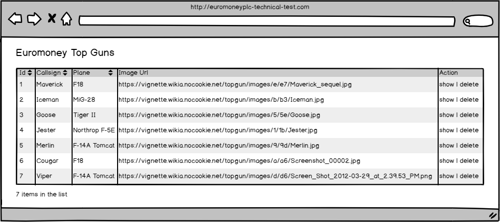
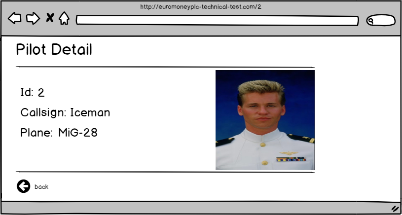

**Overview**

You are required to create a simple app which shows information about "Euromoney Top Guns", the MVP requirements are listed below. Additional features are planned for the future so structure the application in such a way that it can be easily extended and the existing code reused.

The code must be written in Angular (not AngularJS), React or VueJS (Typescript is optional but preferred). Feel free to use any NPM libraries you like.

**Requirements**

Create an app that displays all the information in the pilots.json file (it can be found in the root directory of this repository). This app should consist of two pages, a listing page and a details page:

**Listing Page**

* The page should display a grid with the following columns:
  * Id - sortable
  * Callsign - sortable
  * Plane - sortable
  * Image Url
  * Action

* The action column should have 2 actions:
  * Show – button that shows the pilot details in another route;
  * Delete – button that removes the pilot from the list
  
* A label on the page displays the number of items displayed in the list. The users should only be fetched once when the app starts, after which they are loaded from memory. A real backend (not the .json file) should be able to be easily substituted in the future.

**Details Page**

The details page should show the following information:
* Id
* Callsign
* Plane
* Image
* A "back" button to return to the listing page

**Considerations**

A few points you might want to consider:

* Tests
* Responsive behaviour
* Code extensibility

**Submissions**
Submit your code by creating a pull request on this repository

**Examples**

Use the wireframes below as a guide, the app is not required to look like this.

